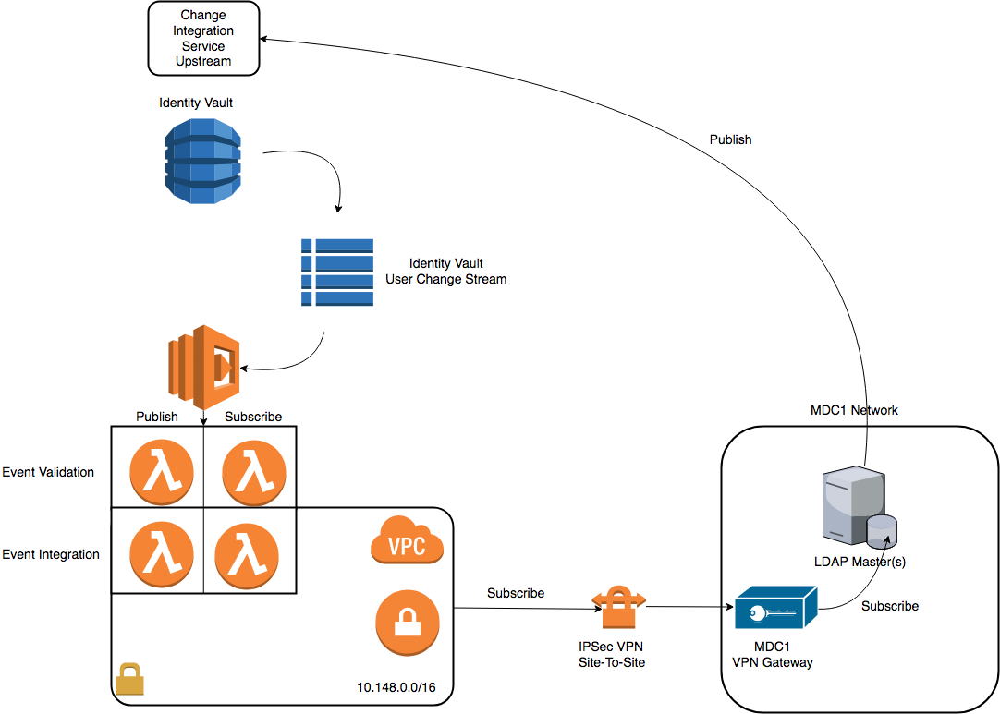

# cis_ldap_integration
Change integration service ldap publisher / subscriber.

# Roadmap

LDAP Publisher : Planned Q4 2017
LDAP Subscriber : 2018

# Definitions

__Publisher__: the act of receiving change events in the change integration service stream from a change event in LDAP.  _Example_ : an ldap user is added to a new group and within "n" minutes that group change is part of the app.metadata in the identity vault.

__Subscriber__: the act of LDAP modification based on an event in the CIS stream.  _Example_: a users preferred name is modified in Mozillians.org and the corresponding record is updated in LDAP using a DynamoDb stream processor.

# Design

The LDAP publisher and subscribers will both live in this repository.  The delivery mechanism for the code will be the serverless framework.  CIS core is written in python using Apex framework and will likely move to serverless framework at some time in the future.  

## Design Components

__Lambda Functions__ :

  - Publisher event validation
  - Publisher ldap interaction

  - Subscriber event validation
  - Subscriber event interaction

> Lambda functions will follow a simple two function pattern that is common in serverless security.  Where the first function simply sanity checks the data and if the data is valid it will invoke-asynchronously the subsequent function which will in turn interaction with LDAP.

__Networking Components__:

  - VPC (Dedicated)
  - VPC IPSec connection to Mozilla MDC1 and MDC2 for ldap subscriber.

The event validators will run in the standard Lambda configuration in the configuration that allows access to AWS API endpoints.  The ldap interaction functions will be invoked and run in the VPC allowing IPSec access to the datacenter.

_Note: IPSec will be used in tandem with LDAP+TLS and LDAP ACLs allowing for layers of security for writing to Mozilla LDAP._

__Secret Storage__:

Like all other components in Mozilla IAM running in AWS this service shall use credstash as the secret storage mechanism with KMS envelope encryption for fetching things like _ldap + tls_ certs.

__Message Integrity__:

Messages shall be signed by both publisher and subscriber using the Mozilla's pykmssig library available at : https://github.com/mozilla-iam/pykmssig

This library uses AWS KMS authentication encryption to bury two different hashes in an envelope encrypted against a KMS signing key.  ( _Note: KMS Signing keys are no different than standard CMK_ ) The primary difference between a CMK and Signing key in this case is that everyone is allowed to decrypt the hashes in the envelope but only trusted publishers can create the signature with the appropriate encryption context.  ( Uses Galois Counter Mode AES )

## Contributors

* @jdow ( jabba )
* @andrewkrug ( andrewkrug )
* @gdestuynder ( kang )
